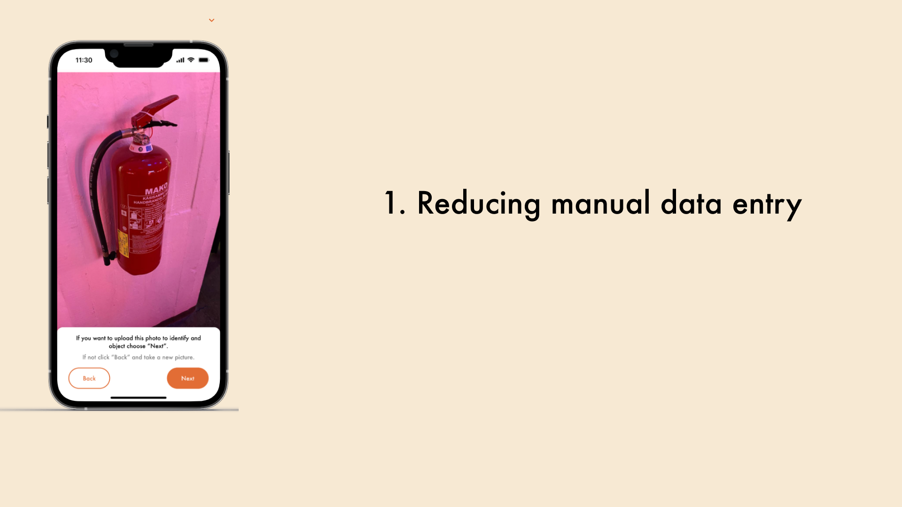
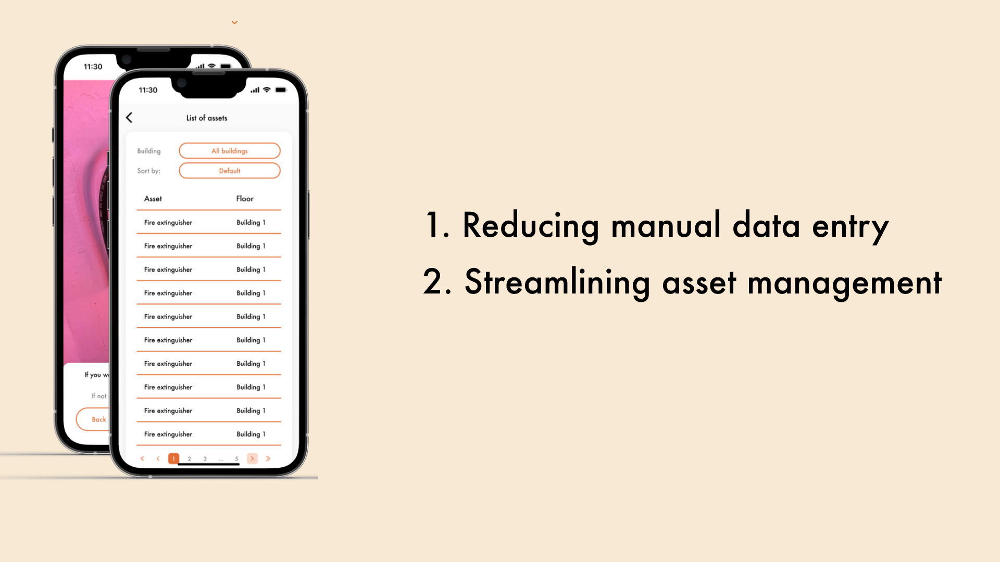
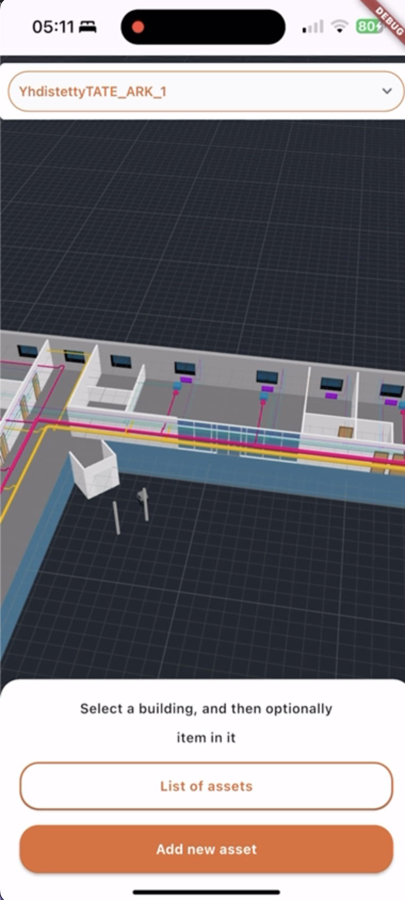
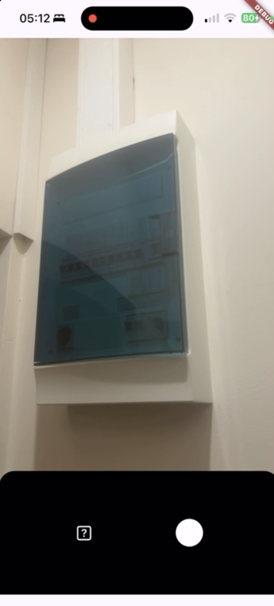
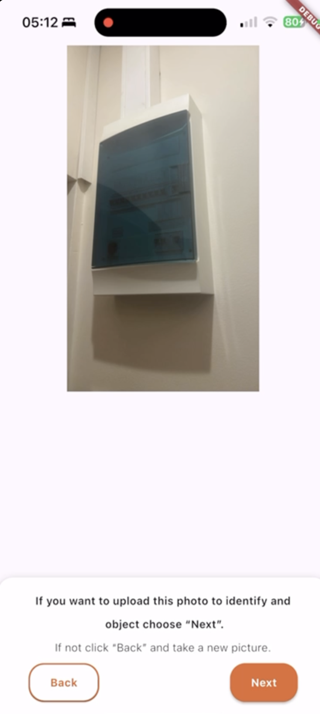
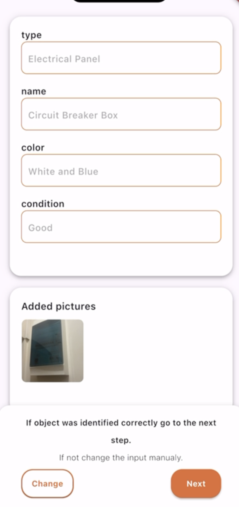
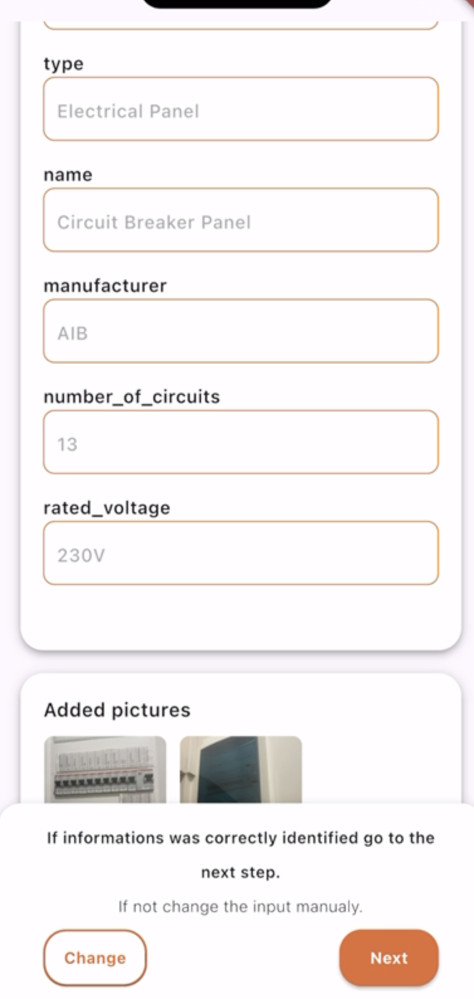
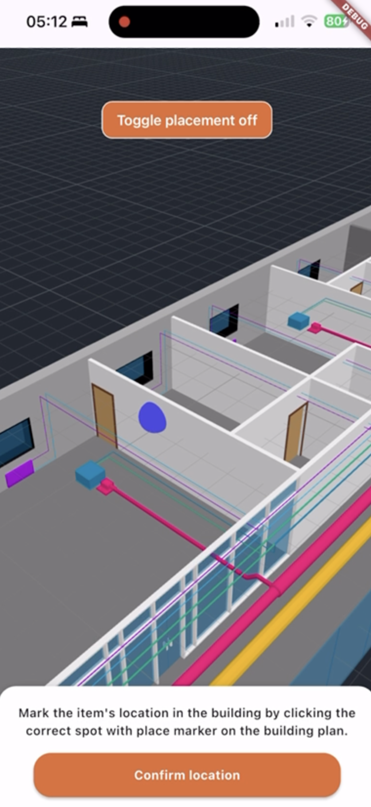
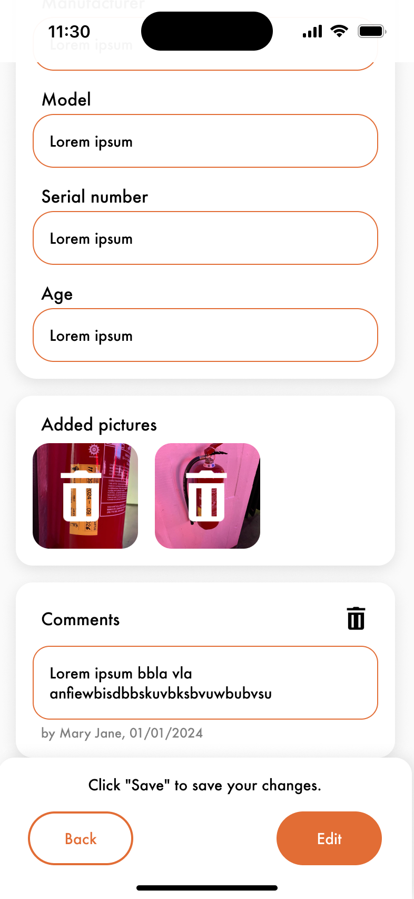
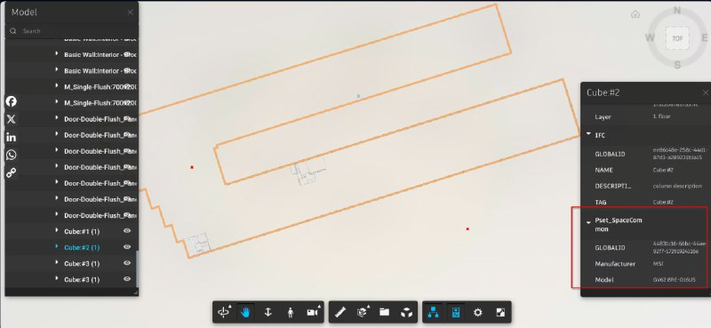

# Junction AssetEase

## Overview

Managing building assets can be complex, time-consuming, and prone to errors. In today's fast-paced world, companies need efficient, reliable solutions to streamline operations and improve decision-making.

Introducing our innovative solution: a powerful tool that integrates seamlessly with Building Information Modeling (BIM) to add and manage assets in real-time

With just a few clicks, you can add, update, or remove assets directly from the BIM model, ensuring your building data is always up-to-date and accurate.

- Eliminating the need for manual entry, saving time and reducing human error.

- Streamlining asset management, so you can quickly track and manage your building inventory.

- Providing you with accurate, real-time data to make better, more informed decisions.

- Allowing 3D object management and positing access ON YOUR PHONE!!

## Showcase

## BIM model modification

## e2e presentations

Youtube demos:
https://www.youtube.com/watch?v=8fssnCvUscI

https://youtube.com/shorts/cZaIcxp7YPg

Object modification shown on BIM models

.png>)

## Implemented features

- Advanced tag detection
- Real-time asset management
- Seamless integration with BIM models
- 3D object management via mobile devices
- Automated data synchronization
- User-friendly interface
- Comprehensive asset tracking
- Error reduction through automation
- Enhanced decision-making with accurate data
- Customizable asset categories and attributes
- Multi-user collaboration support
- Detailed reporting and analytics
- Scalability for large projects
- Cross-platform compatibility
- Support for IOS, Android, MacOS, Windows systems.
- Optimized rendering as a mobile application.
- Multi image support for advanced tag detection and merging.
- Upstream inventory updates.
- Responsive and Easy-To-Go system

## Other links

Due to the nature of mobile apps it cannot be hosted and presented real time.
However below links for backend and micro frontend is attached.

Backend -> https://junction.rabbithole.carrotly.tech/graphql

MicroFronted (which is only an iframe for the mobile app) -> https://junction-front.rabbithole.carrotly.tech
